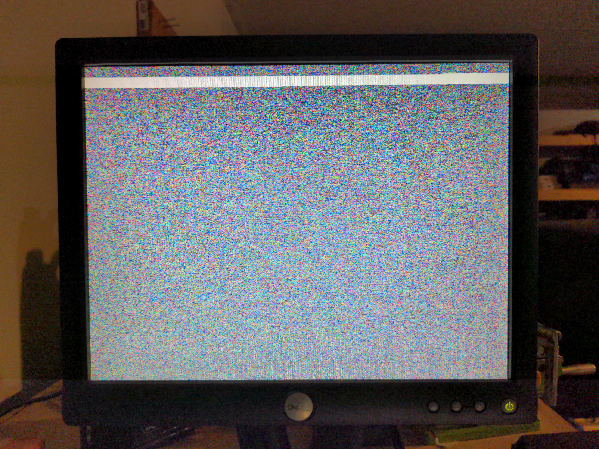
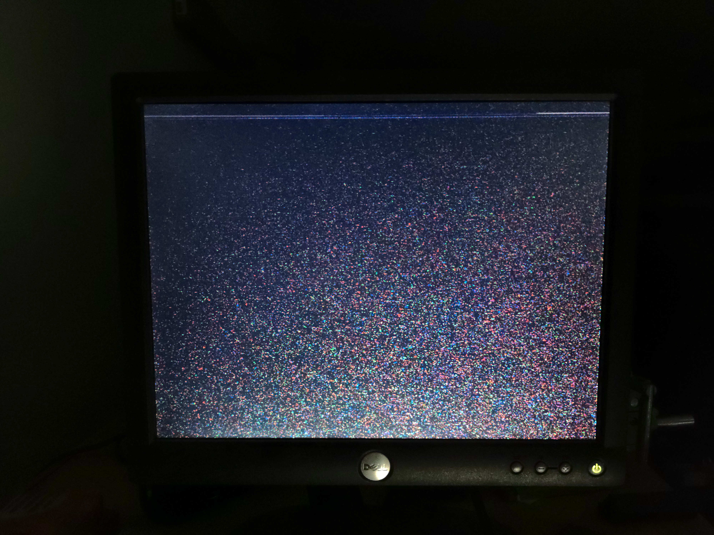

# 16 bit fpga driven video card

Currently only spi is (mostly) implemented and not ISA
commands:
* 0x80 - return device status. 0 = input buffer empty. anything else = input buffer full (the input buffer only holds one 16 bit word)
* 0xB0 - vram pointer address bits 0-7
* 0xB1 vram pointer address bits 8-15
* 0xB2 vram pointer address bits 16-24
* 0xB3 video control flags. use bit 0 to toggle between test pattern and displaying vram
* 0xB4 vram data register input. send 2 bytes to this register with spi and then the byte will be copied into the location pointed to by registers 0xB0, 0xB1 and 0xB2

# the main bug right now: 
vram can only be read from if there haven't been any write cycles. Once the first write cycle happens, the system is no longer able to read until the next power cycle. Terminating the write cycle or waiting for it to end does not restore vram read capability. Even the RESET pin doesn't fix this, it has to be a power cycle. If you quickly power-cycle after a write, you can even SEE the pixels that were written, still in VRAM, just being displayed correctly

Before writing to vram (the white line is the area I keep writing to for testing. its still in vram from the last power cycle):

After writing to vram (notice how there's kind of a line in the area being written to but the entire rest of the screen is different):

Here is an example of the test pattern. It displays correctly whether or not the vram bug has been triggered
