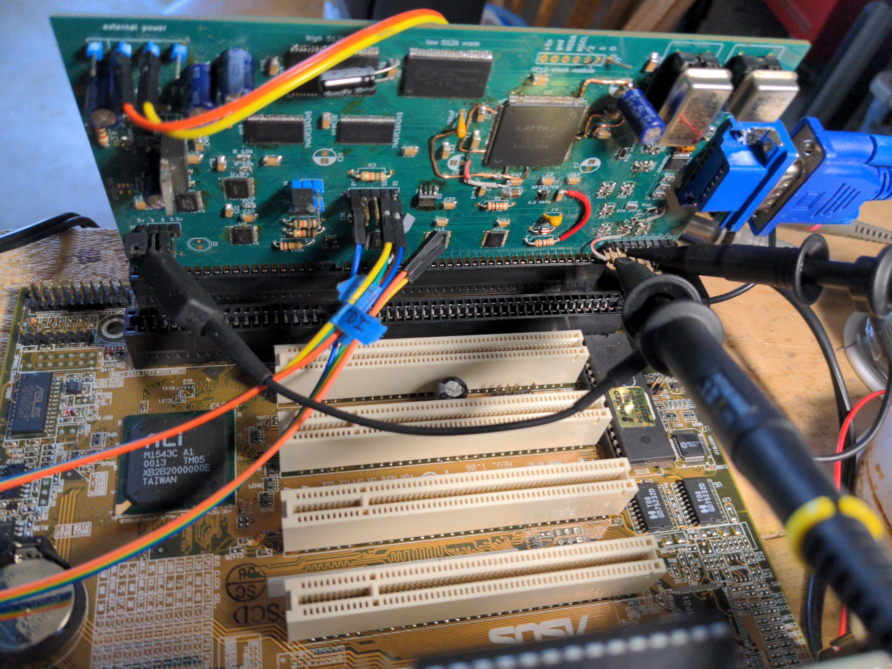
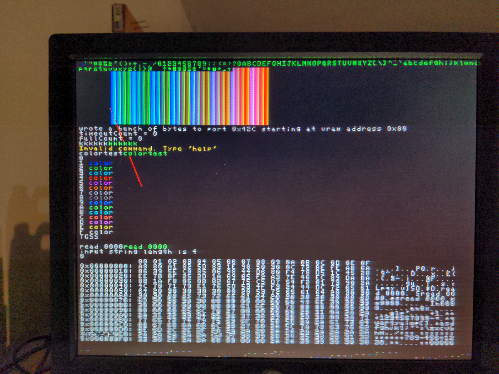
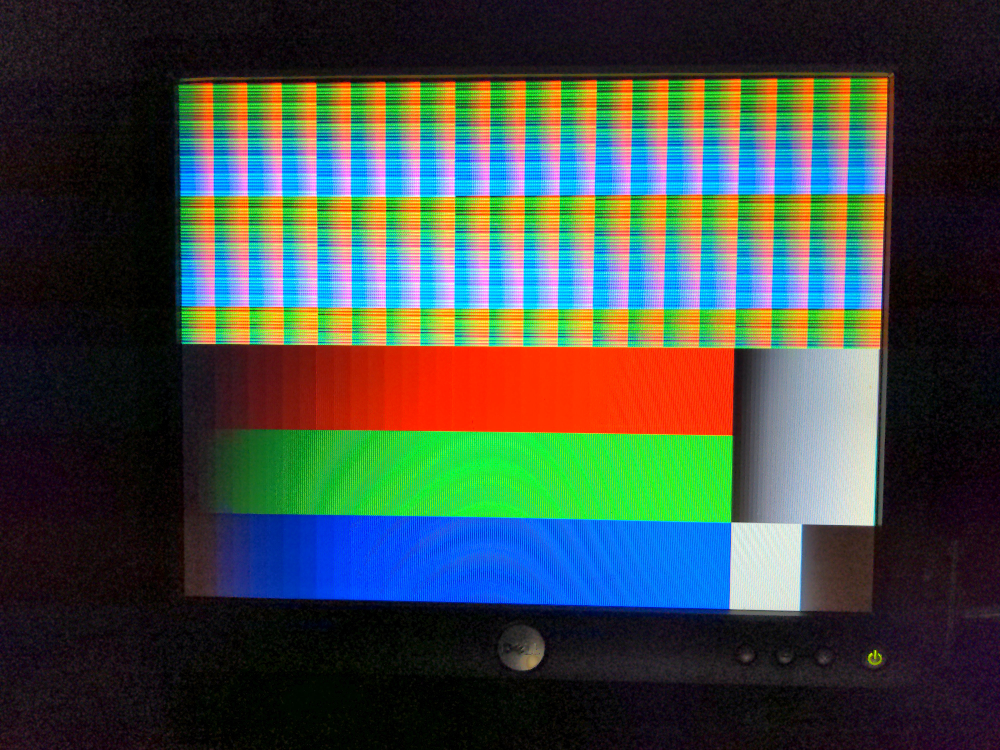

# 16 bit fpga driven video card

### ISA interface ports:
- 0x423. settings register
- 0x426 - status register
- 0x428 address pointer low byte register (can also recieve 16 bit isa data cycles)
- 0x429 address pointer middle byte register
- 0x42A address pointer high byte register
- 0x42C data register

# what it does right now
It displays a 640x480 signal with 16 bit color depth. It also has a mostly working ISA interface. The video signal is far from perfect. This code is the best known configuration that involves a pixel clock that is asynchronous from the pixel clock and also the best known configuration overall. A synchronous pixel clock version will be posted shortly. There is currently no known synchronous pixel clock verilog code configuration that produces better video output than this version, but I highly doubt all the bugs can be solved with asynchronous clocks which is why a synchronous version is being worked on.

The pixel clock is 25.175MHz and the pll clock is 75.525MHz.

Here is an example of it outputting something. The asynchronous pll clock version has a terrible screen wobble bug (as the only major bug) so do not be fooled by what appears to be a good signal.

Here is a test pattern

