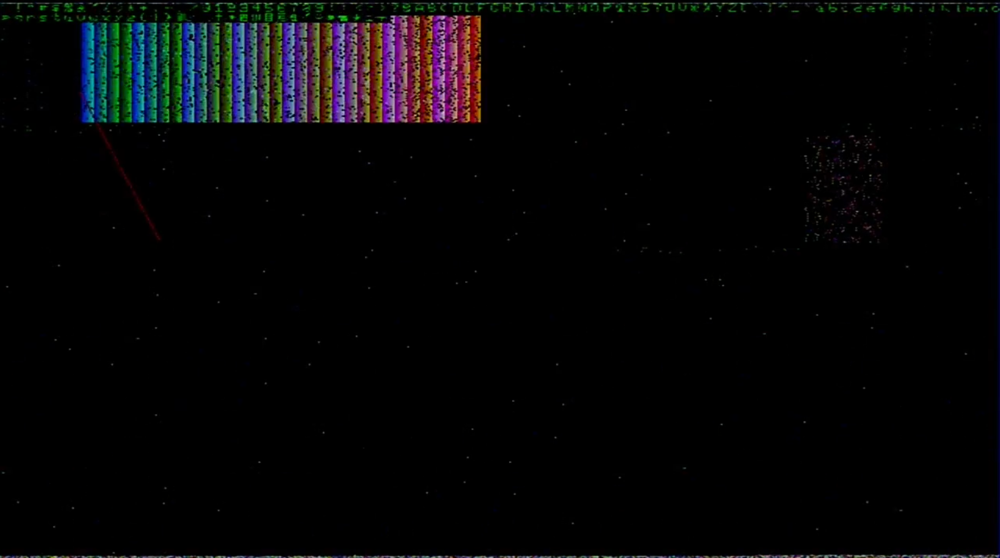

# 16 bit fpga driven video card

### ISA interface ports:
- 0x423. settings register
- 0x424-0x425. line draw register
- 0x426 - status register
- 0x428 address pointer low byte register
- 0x429 address pointer middle byte register
- 0x42A address pointer high byte register
- 0x42C data register

# what it does right now
It displays a 640x480 signal with 16 bit color depth. It also has a mostly working ISA interface. The video signal is far from perfect.

Here is an example of it outputting something

Here is a test pattern

### disclaimer
This is not a fully completed and fully functional video card. If anyone finds ways to make this work better, please say so, all suggestions are welcome. There is a discord server to discuss this stuff here: [discord server](https://discord.gg/2UbdS4unc4)

### What you need for building the verilog code
- nextpnr
- icestorm
- yosys
(i think that's everything)
